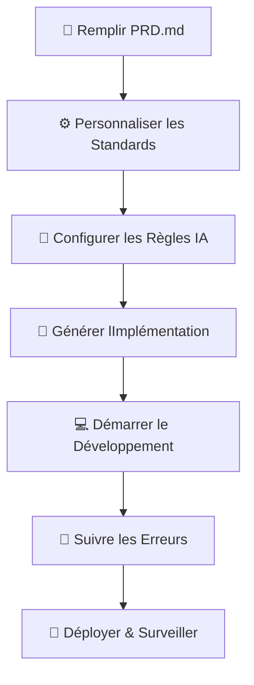

##### EN COURS #####
# DERNIÈRE MISE À JOUR : 12/07/2025

# CONTEXT WORKFLOW - Framework de Développement Alimenté par lIA

Un système de workflow complet qui transforme les documents de spécifications fonctionnelles (PRD) en plans dimplémentation exploitables grâce à lassistance de lIA.

## 🎯 Quest-ce que Context Workflow ?

Context Workflow est une approche structurée du développement logiciel qui :

- **Transforme les idées en actions** - Convertit les PRD en plans dimplémentation détaillés.
- **Garantit la cohérence** - Maintient les standards du projet à travers toutes les phases de développement.
- **Accélère le développement** - Utilise lIA pour générer une documentation technique complète.
- **Prévient les problèmes courants** - Intègre les meilleures pratiques et le suivi des erreurs.

## 🚀 Guide de Démarrage Rapide

### Étape 1 : Définissez votre projet

**Remplissez le fichier PRD.md**

- Décrivez la vision et les objectifs de votre projet.
- Listez les fonctionnalités clés et les exigences.
- Définissez les métriques de succès et les contraintes.
- Utilisez le modèle et les exemples fournis.

### Étape 2 : Personnalisez vos standards

**Examinez et adaptez ces fichiers aux besoins de votre projet :**

📁 **Project_structure.md**

- Modifiez les modèles dorganisation des dossiers.
- Adaptez-les à votre pile technologique (React, Vue, Angular, etc.).
- Mettez à jour les conventions de nommage des fichiers.

🎨 **UI_UX_doc.md**

- Personnalisez les palettes de couleurs et lidentité visuelle.
- Ajoutez vos directives de marque.
- Modifiez les modèles de composants pour votre système de design.

🐛 **bugs_tracking.md** _(facultatif)_

- Adaptez les modèles de rapport de bug.
- Personnalisez les niveaux de priorité et les catégories.
- Ajoutez des outils de débogage spécifiques au projet.

### Étape 3 : Configurez les règles de lIA

**Vérifiez et adaptez les règles du workflow :**

- Consultez `.cursor/rules/workflow.mdc`.
- Mettez à jour si vous avez modifié la structure du projet.
- Assurez-vous que les règles correspondent à vos préférences de développement.

### Étape 4 : Générez le plan dimplémentation

**Utilisez votre modèle dIA pour créer la feuille de route :**

```
Prompt : "Generate the Implementation.md file using the generate.mdc rules"
```

LIA analysera votre PRD et créera :

- ✅ Une décomposition et une priorisation des fonctionnalités.
- 🛠️ Des recommandations sur la pile technologique.
- 📋 Un plan dimplémentation étape par étape.
- 🎯 Des métriques de succès et des directives de test.

### Étape 5 : Commencez le développement

**Commencez à coder avec votre assistant IA :**

```
Prompt : "Lets start with Stage 1 of the implementation plan"
```

## 📋 Alternative : Version Lite

Pour les débutants ou les projets plus simples, utilisez la version lite :

1. Renommez `generate-lite-version.mdc` en `generate.mdc`.
2. Cette version propose :
   - Des instructions simplifiées.
   - Plus de conseils pour les débutants.
   - Un processus de prise de décision rationalisé.

## 🔄 Aperçu du Workflow



## 📁 Structure du Projet

```
CONTEXT_WORKFLOW/
├── 📄 PRD.md                    # Document de spécifications (PRD)
├── 📄 README.md                 # Ce fichier
├── 📁 Documentations/
│   ├── 📄 Implementation.md     # Plan dimplémentation généré
│   ├── 📄 Project_structure.md  # Guide dorganisation des dossiers
│   ├── 📄 UI_UX_doc.md         # Documentation du système de design
│   └── 📄 bugs_tracking.md     # Modèles de suivi de bugs
└── 📁 .cursor/rules/
    ├── 📄 generate.mdc          # Règles de génération IA
    └── 📄 generate-lite-version.mdc # Version simplifiée
```

## 🎯 Avantages Clés

### Pour les Développeurs

- **Configuration de projet plus rapide** - Élimine la confusion de la phase de planification.
- **Qualité de code constante** - Meilleures pratiques intégrées.
- **Meilleure documentation** - Guides complets générés automatiquement.
- **Temps de débogage réduit** - Suivi structuré des erreurs.

### Pour les Équipes

- **Compréhension commune** - Vision et standards de projet clairs.
- **Processus évolutifs** - Fonctionne aussi bien pour les petits projets que pour les applications dentreprise.
- **Rétention des connaissances** - Documentation des décisions et des solutions.
- **Efficacité de lintégration (Onboarding)** - Les nouveaux membres sont opérationnels rapidement.

### Pour les chefs de projet

- **Jalons clairs** - Suivi de limplémentation étape par étape.
- **Atténuation des risques** - Identifie les problèmes potentiels tôt.
- **Planification des ressources** - Calendriers et exigences réalistes.
- **Assurance qualité** - Étapes de test et de validation intégrées.

## 🛠️ Technologies Supportées

Le workflow est flexible et supporte diverses piles technologiques :

### Frontend

- ⚛️ React (Next.js, Vite, CRA)
- 🖖 Vue.js (Nuxt.js, Vite)
- 🅰️ Angular
- 📱 React Native / Flutter
  ......

### Backend

- 🟢 Node.js (Express, Fastify, NestJS)
- 🐍 Python (Django, FastAPI, Flask)
- ☕ Java (Spring Boot)
- 🦀 Rust (Axum, Actix)

---

### Bases de données

- 🐘 PostgreSQL
- 🍃 MongoDB
- 🔥 Firebase
- 🏠 SQLite
  .....

## 📚 Explication des Fichiers de Documentation

### 📄 PRD.md

**La fondation de votre projet**

- Vision et objectifs du projet.
- Exigences fonctionnelles et priorités.
- Métriques de succès et contraintes.
- Public cible et cas dutilisation.

### 📄 Implementation.md

**Feuille de route générée** (créée par lIA)

- Sélection de la pile technologique.
- Décomposition des fonctionnalités par priorité.
- Plan de développement étape par étape.
- Directives de test et de déploiement.

### 📄 Project_structure.md

**Guide dorganisation du code**

- Exemples de structure de dossiers.
- Conventions de nommage des fichiers.
- Modèles dimport/export.
- Meilleures pratiques pour lévolutivité (scalability).

### 📄 UI_UX_doc.md

**Documentation du système de design**

- Palettes de couleurs et typographie.
- Modèles de conception des composants.
- Directives de design responsive (adaptatif).
- Normes daccessibilité.

### 📄 bugs_tracking.md

**Système de gestion des incidents**

- Modèles de rapport de bug.
- Définitions des priorités et catégories.
- Documentation des solutions.
- Stratégies de prévention.

## 🤖 Conseils dIntégration de lIA

### Meilleurs Prompts pour la Génération

```
✅ Bon : "Generate Implementation.md using the PRD and project structure guidelines"
❌ À éviter : "Make me a plan"

✅ Bon : "Start Stage 1 implementation focusing on authentication setup"
❌ À éviter : "Code something"
```

### Collaboration efficace avec lIA

EN COURS

## 🚨 Problèmes courants & Solutions

EN COURS

## 🔧 Guide de personnalisation

EN COURS

## 🏁 Prêt à commencer ?

1. **Clonez ce dépôt**.
2. **Remplissez le fichier PRD.md** avec les détails de votre projet.
3. **Personnalisez les fichiers de documentation** pour quils correspondent à vos besoins.
4. **Générez votre plan dimplémentation** à laide de lIA.
5. **Commencez à coder** en toute confiance !

**Bon codage ! 🚀**

---

EYS
